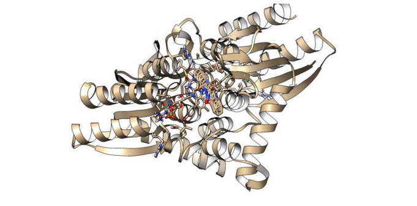

# Molecular-Docking-pipeline-Deleting-toxic-compounds.-

## Introduction

Azo Reductases, which degrade Azo dyes into colorless amines through reductive cleavage. This process requires a low molecular weight-reducing molecule such as FADH or NADH as an electron donor. 
Finally, the enzyme cleaves the azo-type bond (-N = N-) and transfers four electrons as a reducing equivalent. The azo dye works as an electron acceptor causing its discoloration and the formation of an intermediate (a highly toxic aromatic amine) that is subsequently degraded by an aerobic process (Singh RL, or microaerophilically, when conditions are anaerobic, membrane-bound azo reductases use a redox mediator as an electron shuttle.

The objective of the project is to degrade the colorimetric molecules indigo blue and acid orange 10, whose origin is the waste of the textile industry. It is currently known from the literature that azoreductases are a family of enzymes with a high potential to degrade a wide variety of polluting compounds. Inside the group of molecules that this enzyme can degrade are the azo dyes and indigoids. However, they have not been characterized specifically for the degradation of indigo blue and acid orange 10. This means that it would be necessary to study the interaction that laccase and azoreductase enzymes may have with both molecules.

We applied computational methods to study the binding and stability properties of indigo blue and acid orange 10. The azoreductase test was from Pseudomonas putida.

## Methodology 

Here I developed a bioinformatics pipeline to make molecular docking with the azoreductase protein.

1)	The sequences of the protein selected were searched in NCBI and its accession number of the crystallographic structures was retrieved.
   
2)	For the chemical structure of the two compounds to study, both were searched and retrieved from chemical databases.
   
3)	Both ligands and proteins were optimized before their preparation for molecular docking.
   
4)	The active site for the enzyme was searched in the literature. The box the proteins were placed where its active site is known to be located.
    
5)	The results of the molecular docking were evaluated considering the coupling energy and the type of interaction that the complex enzyme-substrate had.
    
6)	The best result of the docking was evaluated through a molecular dynamics simulation to determine the stability and bond of the complex

## Step 1.  LIGANDS STRUCTURE, OPTIMIZATION, AND PREPARATION

The structures of the colorimetric compounds were searched in the public database PubChem (PubChem blue indigo CID 10215 & acid orange CID 16015)
 
The molecular structures of the two dyes were downloaded and optimized using electronic structure calculations with Python software (Rdkit library) with the Merck Molecular Force Field (MMFF).


``` bash

#Install RDkit with anaconda environment 
conda install -c conda-forge rdkit
```

``` Python 
#import libraries from my browser

from rdkit import Chem
from rdkit.Chem import AllChem

#Molecule to minimize (Blue indigo)

m= Chem.MolFromSmiles('C1=CC=C2C(=C1)C(=C(N2)C3=NC4=CC=CC=C4C3=O)O')
m

#Add Hidrogens
m2=Chem.AddHs(m)
AllChem.EmbedMolecule(m2)

#Optimize molecule -> MMFF (Merck Molecular Force Field)

AllChem.MMFFOptimizeMolecule(m2)

#Import molecule optimized

from rdkit.Chem import Draw
img = Draw.MolToImage(m2)
img.show()

```
MMF is a force field to calculi energy and geometry in chemistry molecules. These approaches allow us to describe energy boundaries, flexion energy, solvation energy, etc....  (you can repeat the same approach for the Acid orange 10 ligand) 

How can we ensure that the geometries obtained correspond to a minimum on the potential energy surface, thus indicating a molecular geometry of the structures at their minimum energy?
 In addition to the optimization calculations, in both cases, electronic frequency calculations were performed using the Psi4 program. If you want to calculate this change, you will need to use the Psi4 program and not the Rdkit library (because does not make this step.) 

``` Python
import psi4

# molecule in Psi4
psi4_molecule = psi4.geometry("""
0 1
C
H 1 1.08
H 1 1.08 2 104.5
""")

# Set options for the calculation
psi4.set_options ({
    'basis': 'cc-pvdz',
    'scf_type': 'df',
    'e_convergence': 1e-8,
    'd_convergence': 1e-8
})

# Perform a frequency calculation
psi4_freqs = psi4.frequencies()

print ("Vibrational Frequencies:", psi4_freqs)
```
After the optimization, the ligands were prepared for docking using the Autodock Tool. The polar hydrogens and the partial charges were added, as the tutorial of Autodock Vina says. The ligands were prepared flexibly in both structures.

## Step 2: PROTEINS SEQUENCES, STRUCTURE REFINEMENT, AND PREPARATION

The azoreductases selected were identified in the NCBI database. After, in the Protein Data Bank, the sequence was searched, to download the crystallographic resolve structure of the enzymes to work with them (PDB ID: 4C0X). The structure of the protein was first cleaned and optimized to generate the input structure for docking.

Protein optimization was carried out using AMBER software (https://ambermd.org/). The charges used for the protein were assigned using the AMBER ff14SB force field for standard residues (remember to download the molecule without water molecules, here we do not exclude the FMN ligand from the protein. FMN is needed to perform the analysis) and the Gasteiger charges for no standard residues (Autodock vina).

The goal of energy Minimization of protein structure is to find a set of coordinates for each atom that forms the polypeptide to represent its conformation in a minimum energy value

**You can use Quimera software to minimize the protein. It Is an easier approach**

a)	Minimize parameter (minimize.in file)
Create the file minimize.in file 

``` bash
&cntrl
 imin = 1,      ! Energy minimization
 maxcyc = 5000,  ! Maximum number of minimization steps
 ncyc = 2500,    ! Print frequency for information
 ntb = 0,        ! No periodic boundary conditions.
 cut = 10.0,     ! Nonbonded cutoff
 ntr = 0,        ! No restraint
 /
``` 
b)	Load the PDB file. 

We are going to create a script to generate protein.prmtop and protein.inpcrd 

 ``` bash
#Indicate the name of the Force Field to use
source leaprc.ff14SB (Force Field)

# Load the PDB file
protein = loadPdb azo.pdb

# Create the parameter and topology files
saveAmberParm protein protein.prmtop protein.inpcrd

#Run the script
tleap -f leap_script.in
```

3) Minimize the protein.
   
   With the construction of the minimized parameters and the clean protein we can minimize the protein
   
``` bash
sander -O -i minimize.in -o minimize.out -p protein.prmtop -c protein.inpcrd -r minimized_structure.rst
``` 
Finally, to prepare the enzymes, polar hydrogens were added to the proteins, the non-polar were merged and the charges were assigned as the Vina tutorial says. 

## Step 3. Docking preparation

The active site of the Pseudomonas enzyme is in a contact site of a homodimer of the enzyme. Where the cofactor riboflavin 5′-phosphate or FMN is responsible for positioning the substrate for oxidation.  So, the docking box was placed where the FMN molecule was located. 

a)	We need to convert the minimized structure to an appropriate entry to vina.

``` bash
ambpdb -p protein.prmtop < minimized_structure.rst >  minimized_structure.pdb
```

b)	Create a configuration (conf.txt) entry to Vina. 

``` bash
receptor = minimized_structure.pdb
ligand = ligand.pdb
center_x = 0.0
center_y = 0.0
center_z = 0.0
size_x = 20.0
size_y = 20.0
size_z = 20.0
exhaustiveness = 8
``` 

Here, we decided to use a square box with 20 points in all the directions and spacing of one angstrom. Finally, the docking was run using the software Autodock Vina.
We are going to use Autodock 4. We download the configuration box (conf.txt) from the software and perform the docking with:

``` bash
vina --config vina_config.txt --out docking_results.pdbqt --log docking_log.txt
``` 
Keep in mind that: You need to specify the receptor or protein file in your conf.txt configuration file. In the conf.txt file, there should be a line that specifies the receptor (as in the example)

## STEP 4 RESULTS OF DOCKING ANALYSIS

The results of the coupling of the enzyme with the two dyes studied by Autodock Vina were visualized through the Discovery Studio 2021 platform. 
These results were evaluated considering three important points:

i)	The interacting residues of each pose contain any of the residues marked in the alignment.

ii)	 The affinity energy

iii)	 The type of interactions that the residues present with the molecules. Therefore, the selected poses have at least one of the residues marked by multiple alignments, stable binding energy, and present the highest amount of hydrogen bonds between the complex enzyme-ligand.

Molecular docking with indigo blue azo dye:




